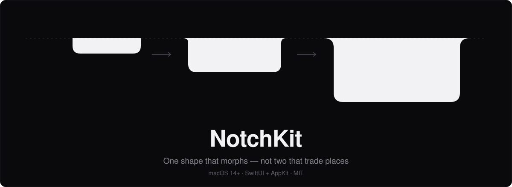

<p align="center">
  
</p>

<p align="center">
  <a href="#requirements"></a>
  <a href="#requirements"></a>
  <a href="LICENSE"></a>
  <a href="https://github.com/sponsors/duongductrong"></a>
  <a href="https://ko-fi.com/duongductrong"></a>
  <a href="docs/"></a>
</p>

<p align="center">
  <a href="docs/getting-started.md">Getting started</a> ·
  <a href="docs/customization.md">Customization</a> ·
  <a href="docs/architecture.md">Architecture</a> ·
  <a href="docs/troubleshooting.md">Troubleshooting</a>
</p>

---

**NotchKit** turns the MacBook notch into an interactive Dynamic Island in SwiftUI.
An island rests as a pill against the screen edge and **morphs** open on hover or
click — one shape whose width, height, and corner radii animate together, rather
than two views cross-fading into each other.

That distinction is the library. A cross-fade always reads as a *switch*, because
at no instant is there a single object changing form. NotchKit keeps it to one
`NotchShape`, which works because the resting pill is that same shape at a small
top radius — it flares into the bezel just like the open panel, only less.

You write two SwiftUI views — what the pill shows and what the panel shows.
NotchKit owns the window, the silhouette, hit testing, pointer hysteresis, and the
motion.

## See it

<!--  THUMBNAIL SLOT  ────────────────────────────────────────────────────────
      Record the morph, save it to docs/images/demo.gif, then uncomment the
      block below. Kept commented so the README never shows a broken image.
      Recording recipe: docs/images/README.md

<p align="center">
  
</p>
──────────────────────────────────────────────────────────────────────────── -->

Run it yourself:

```sh
git clone https://github.com/duongductrong/NotchKit.git
cd NotchKit && swift run NotchDemo
```

Then move the pointer to the notch.

## Install

### Xcode

**File → Add Package Dependencies…**, then paste:

```
https://github.com/duongductrong/NotchKit.git
```

### Package.swift

```swift
dependencies: [
    .package(url: "https://github.com/duongductrong/NotchKit.git", from: "1.1.0")
],
targets: [
    .target(name: "YourApp", dependencies: ["NotchKit"])
]
```

## Quick start

Three steps: configure, install two views, drive it.

```swift
import AppKit
import SwiftUI
import NotchKit

@MainActor
final class AppDelegate: NSObject, NSApplicationDelegate {
    // Hold this strongly — the presenter owns the window and nothing else
    // retains it. Let it go and the island silently disappears.
    private var presenter: NotchPresenter?

    func applicationDidFinishLaunching(_ note: Notification) {
        let presenter = NotchPresenter()
        self.presenter = presenter

        presenter.install(
            collapsed: {
                // Content either side of the cutout. The middle of a pill sits
                // behind the physical notch, so anything there is invisible.
                NotchCutoutLayout(
                    cutoutWidth: presenter.geometry.hasPhysicalNotch
                        ? presenter.geometry.notchWidth : 0,
                    gutterWidth: presenter.collapsedGutterWidth,
                    pillHeight: presenter.geometry.collapsedHeight
                ) {
                    Image(systemName: "waveform")
                } trailing: {
                    Text("3").monospacedDigit()
                }
            },
            expanded: {
                // No padding needed — insets are derived from the corner radii.
                VStack(alignment: .leading) {
                    Text("Panel content")
                }
            }
        )
    }
}
```

Make it an accessory app so it takes no Dock icon and never steals focus — either
`LSUIElement` in `Info.plist`, or in code:

```swift
NSApplication.shared.setActivationPolicy(.accessory)
```

Drive it from anywhere:

```swift
presenter.expand()    // open
presenter.collapse()  // close
presenter.toggle()
presenter.peek()      // brief attention bump, self-reverting
```

A complete runnable app is in [`Examples/NotchDemo`](Examples/NotchDemo).

## Customization

Nothing about the content is fixed. There are three slots — left of the cutout,
right of the cutout, and the expanded panel — and all three are plain
`@ViewBuilder`s. Icons, counters, progress, artwork, controls, a whole interface,
or nothing at all. The icon-and-counter above is an example, not a contract.

Everything else is a value type you can swap wholesale or tweak field by field:

| Type | Controls | Presets |
|---|---|---|
| `NotchConfiguration` | Panel size, pill width, hit target, hover policy, radii, insets, top reserve, content alignment | `.standard`, `.clickOnly`, `.statusOnly`, `.canvas`, `.standalone(pillWidth:)` |
| `NotchMotion` | Every curve, delay, and scale | `.standard`, `.crisp`, `.playful`, `.reduced` |
| `NotchStyle` | Ink, shadow, foreground, colour scheme | `.standard`, `.warmPaper`, `.contrast`, `.translucent` |
| `NotchCollapsedWidth` | Whether the pill wraps the cutout or takes a fixed width | `.wrapCutout(reserve:)`, `.fixed(_:)` |
| `NotchExpandedTopReserve` | How much of the panel stays clear of the cutout | `.cutoutOnly`, `.always`, `.fixed(_:)`, `.none` |
| `NotchBarsStyle` | Bar count, sizes, levels, peaks, period, stagger, curve, tint | `.steady(_:)`, `.wave(count:…)` |

All three are `var`s on the presenter, so an app can swap a whole look at runtime —
the window resizes itself when the panel size changes.

**[`Examples/NotchDemo`](Examples/NotchDemo) ships three islands** that share no
content code: an AI coding agent panel with interactive permission prompts (Vibe Code),
a native macOS music controller (Now Playing), and an interactive morph geometry inspector (Morph Inspector).
Each is one `IslandPreset` value; adding a
fourth needs no library changes. That is the pattern to copy.

```swift
var config = NotchConfiguration.standard
config.expandedSize = CGSize(width: 560, height: 300)
config.collapsedWidth = .wrapCutout(reserve: 52)

let presenter = NotchPresenter(
    configuration: config,
    motion: .resolved(.playful),  // .resolved honours Reduce Motion
    style: .contrast
)
```

Full reference, plus custom shapes and indicators: **[docs/customization.md](docs/customization.md)**.

## Documentation

| Guide | What is in it |
|---|---|
| [Getting started](docs/getting-started.md) | Install, first island, accessory-app setup, verification checklist |
| [Customization](docs/customization.md) | Every knob, custom silhouettes, custom indicators, content slots |
| [Architecture](docs/architecture.md) | The layer split, why the window never resizes, coordinate spaces |
| [Motion](docs/motion.md) | Spring parameters explained, the curve table, designing a new motion set |
| [Recipes](docs/recipes.md) | Notification island, progress, media controller, multi-display, hotkeys |
| [MorphSection](docs/morph-section.md) | Inspecting sub-elements, missions, parameters, and interactive controls |
| [Troubleshooting](docs/troubleshooting.md) | ~40 symptom → cause → fix entries |

## Requirements

- macOS 14+ — `@Observable` and `Animation.smooth` both land at or before it,
  which keeps the source free of availability branches.
- Swift 5.9+
- No dependencies.

Works on displays without a hardware notch too; the island renders as a standalone
pill and skips the concave top corners, which would otherwise look like a
rendering fault where there is no cutout to fuse with.

## Contributing

The geometry layer is deliberately pure functions, because notch bugs reproduce
only on specific hardware with specific menu-bar settings — hand-testing does not
find them and regressions stay invisible until a user with the right laptop
complains. If you add anything that depends on display state, put the maths in a
`static` function that takes the readings as arguments and pin it in `Tests/`.

```sh
swift build && swift test    # no display required
```

## Sponsor

If NotchKit helps you build great macOS apps, consider supporting the project:

- [GitHub Sponsors](https://github.com/sponsors/duongductrong)
- [Ko-fi](https://ko-fi.com/duongductrong)

## License

[MIT](LICENSE)
